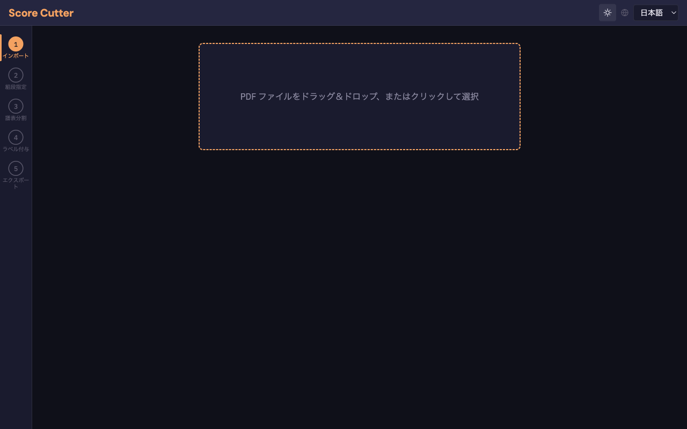
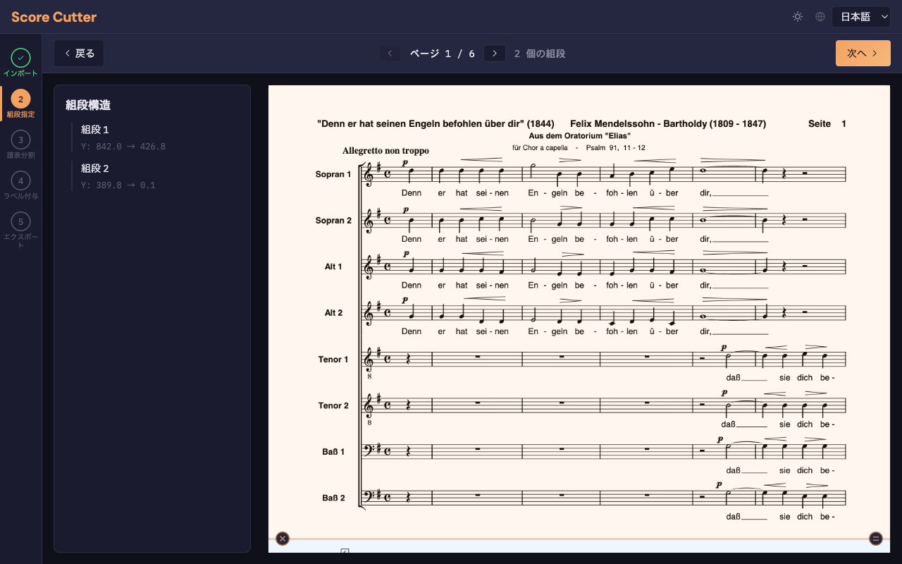
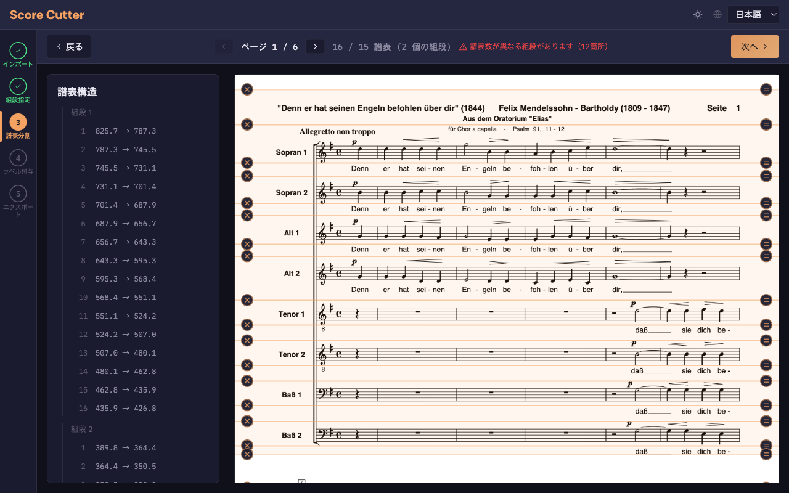
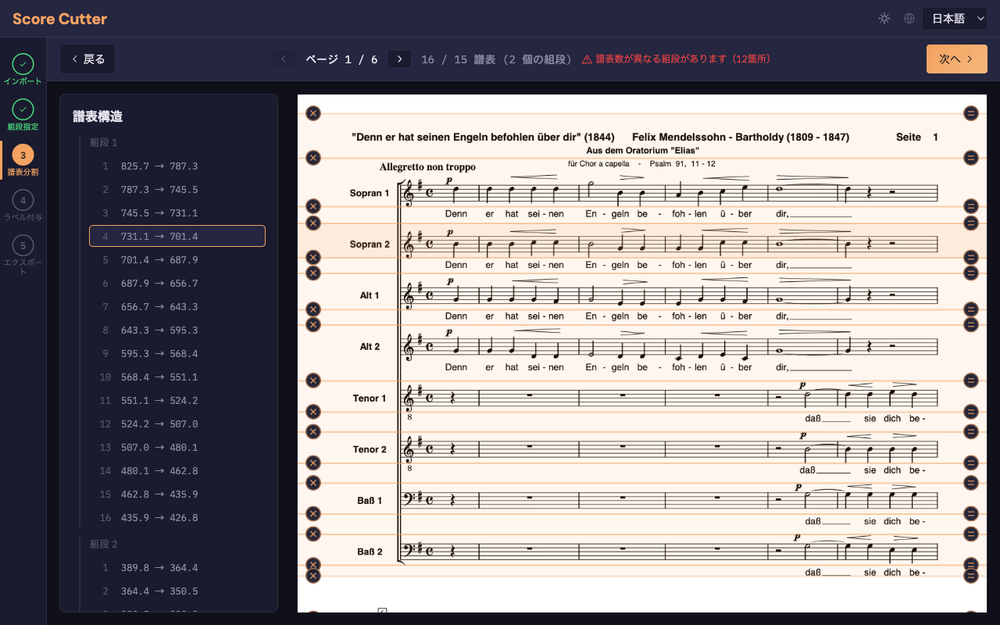
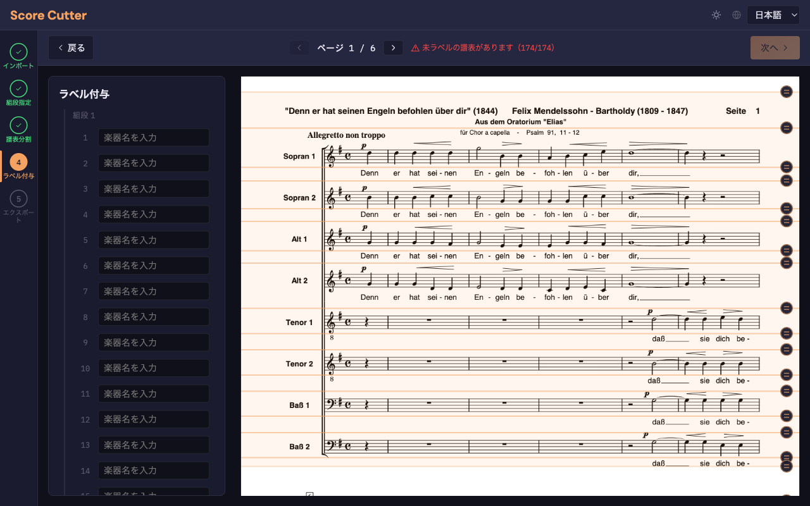
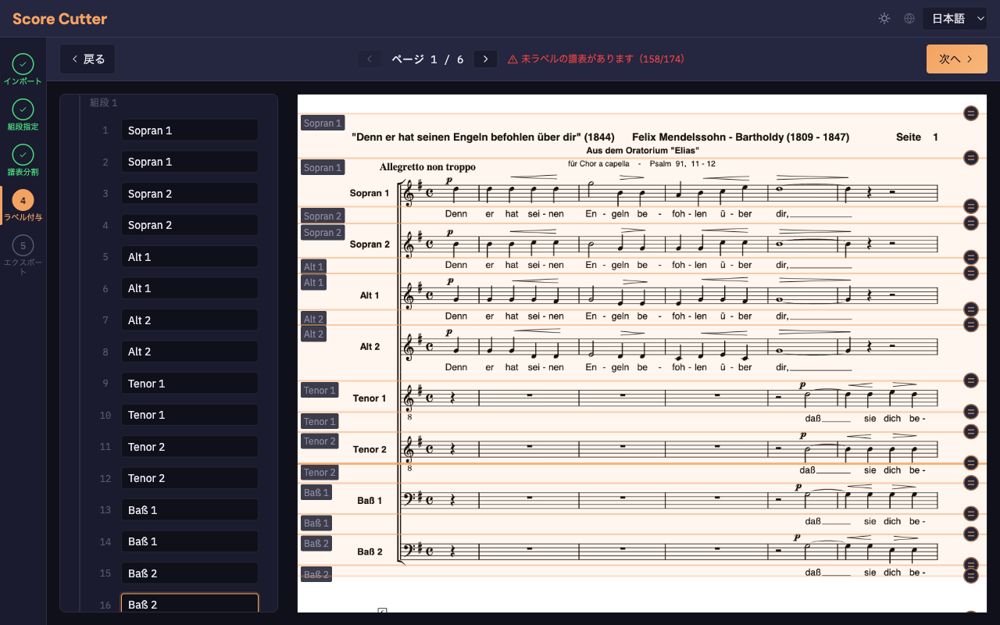
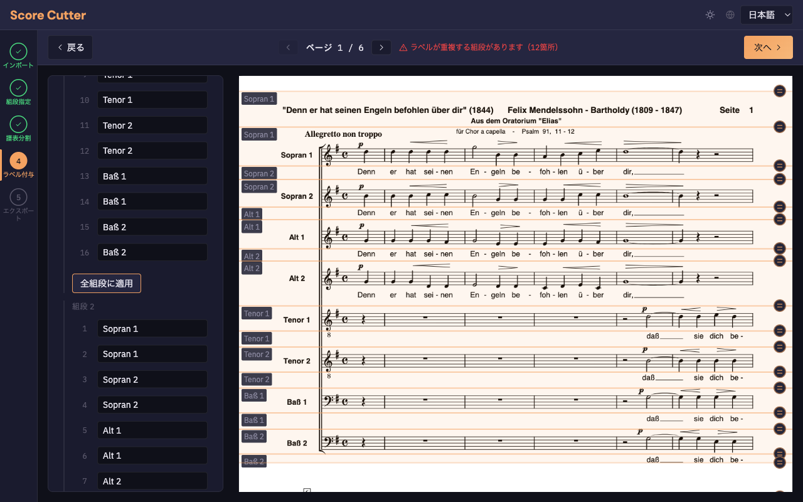
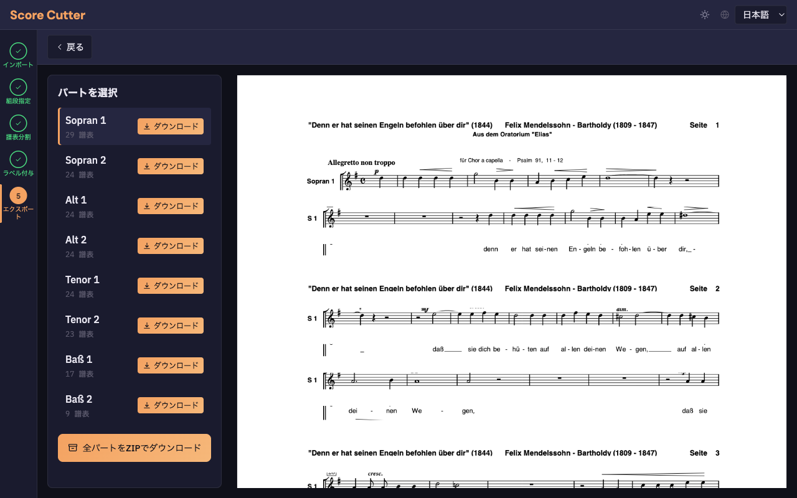
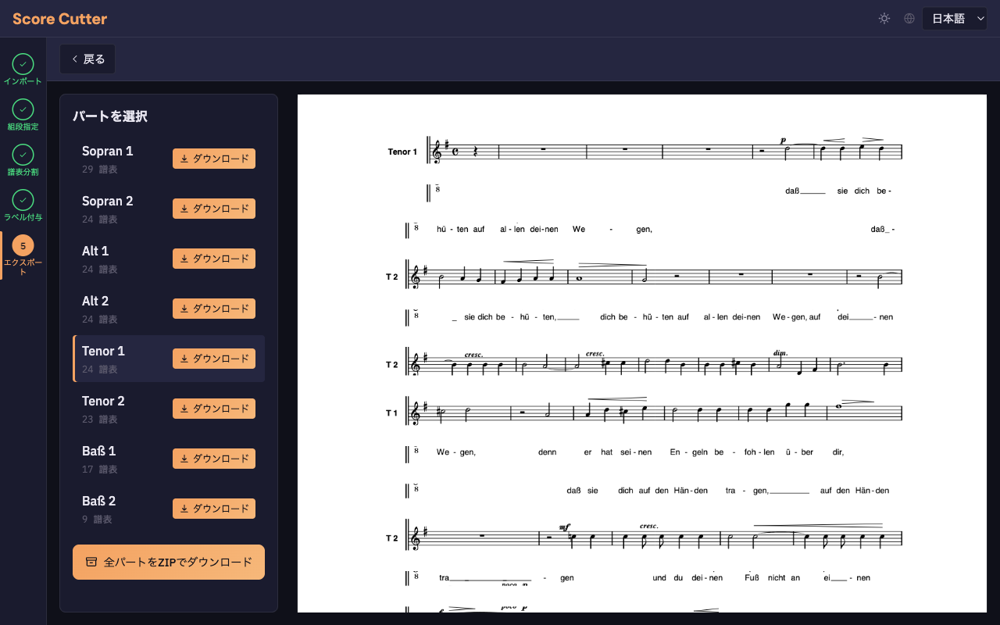
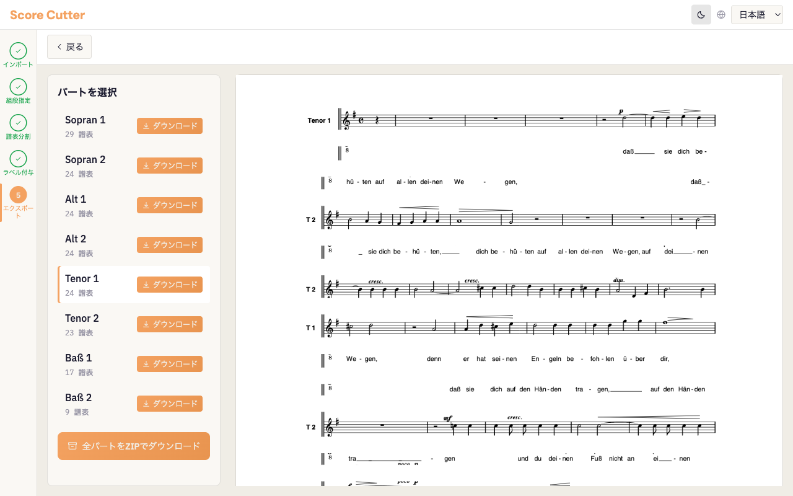

# Score Cutter 操作チュートリアル

Score Cutter は、オーケストラや合唱の総譜（フルスコア）PDF から、各楽器・声部ごとのパート譜を自動抽出するブラウザアプリです。5つのステップで操作が完了します。

## 必要なもの

- モダンブラウザ（Chrome / Edge / Firefox / Safari）
- 総譜の PDF ファイル

---

## ステップ 1: インポート

アプリを開くと、PDF アップロード画面が表示されます。

- PDF ファイルをドロップゾーンに**ドラッグ＆ドロップ**するか、クリックして選択します
- 読み込みが完了すると、自動的に次の「組段指定」ステップに進みます

---

## ステップ 2: 組段指定（Systems）

組段（System）とは、ページ上で全パートが縦に並んだひとまとまりの領域です。通常、1ページに1〜3個の組段があります。

- **自動検出**: ページを読み込むと、水平投影法により組段の境界が自動で検出されます
- **ページナビゲーション**: ツールバー中央の「< ページ X / Y >」で各ページを確認できます
- **サイドバー**: 左側に検出された組段の一覧と PDF Y 座標が表示されます

### 組段の編集

- **境界線をドラッグ**: 組段の境界を上下に移動できます
- **ダブルクリック（組段内）**: 組段を2つに分割します
- **ダブルクリック（境界線上）**: 隣接する組段を結合します

確認できたら「**次へ**」をクリックします。

---

## ステップ 3: 譜表分割（Staffs）

各組段内の個別の譜表（Staff）が自動検出されます。

- **ツールバー**: 各組段の譜表数と、バリデーション（譜表数の一致確認）が表示されます
- **サイドバー**: 譜表の一覧が組段ごとにグループ化されて表示されます

- **サイドバーの行をクリック**: 対応する譜表がキャンバス上でもハイライトされます
- **区切り線のドラッグ**: 譜表の上下境界を調整できます
- **ダブルクリック（譜表内）**: 譜表を2つに分割します
- **ダブルクリック（区切り線上）**: 隣接する譜表を結合します

確認できたら「**次へ**」をクリックします。

---

## ステップ 4: ラベル付与（Label）

各譜表に楽器名（ラベル）を入力します。

1. サイドバーの入力欄に**楽器名を入力**します（例: Sopran 1, Alt 2, Tenor 1 など）

2. 1つの組段のラベルを入力したら、「**全組段に適用**」ボタンをクリックします
   - 同じ順序位置の譜表に、全ページの全組段にラベルがコピーされます

3. ツールバーのバリデーション表示で以下を確認します:
   - 全譜表にラベルが設定されているか
   - 重複するラベルがないか
   - ラベルの順序が全組段で一致しているか

全譜表にラベルが付くと「**次へ**」が有効になります。

---

## ステップ 5: エクスポート（Export）

抽出されたパート一覧が表示されます。

- **パートを選択**: サイドバーでパート名をクリックすると、右側にプレビューが表示されます

- **個別ダウンロード**: 各パートの「ダウンロード」ボタンで PDF をダウンロードできます
- **一括ダウンロード**: 「**全パートをZIPでダウンロード**」ボタンで全パートを ZIP ファイルとしてまとめてダウンロードできます

---

## 応用操作

### キーボードショートカット

| キー | 操作 |
|------|------|
| `Tab` | 次の区切り線にフォーカス移動 |
| `↑` / `↓` | 区切り線を 1px 移動 |
| `Shift + ↑` / `Shift + ↓` | 区切り線を 10px 移動 |
| `Delete` / `Backspace` | 譜表の結合・削除 |
| `Escape` | 選択解除 |
| `Ctrl/Cmd + Z` | 元に戻す（Undo） |
| `Ctrl/Cmd + Y` | やり直す（Redo） |

### テーマ・言語切替

ヘッダー右側のボタンで操作できます:

- **テーマ切替**: 太陽/月アイコンをクリックしてダーク/ライトモードを切り替えます

- **言語切替**: ドロップダウンで日本語/英語を切り替えます
